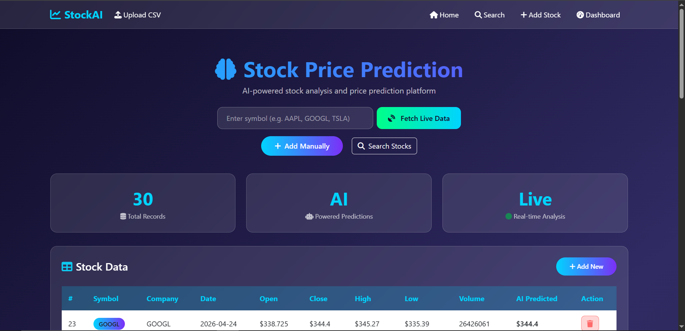
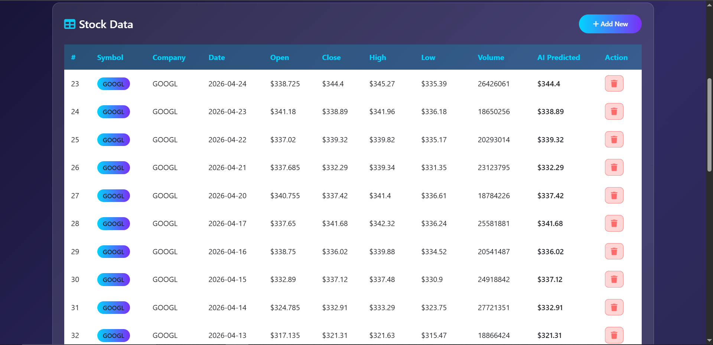
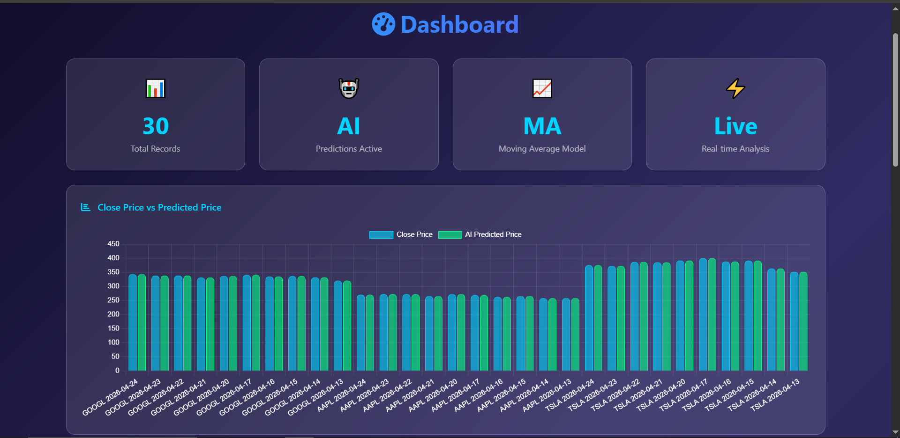

# 📈 Stock Price Prediction - AI Powered

An AI-powered full-stack web application built with Java Spring Boot 
that predicts stock prices using Moving Average Algorithm and 
fetches real-time stock data.

## 🚀 Live Features

- 🤖 **AI Price Prediction** - Moving Average Algorithm
- 📊 **Real-time Stock Data** - Alpha Vantage API integration
- 📈 **Interactive Charts** - Price history visualization
- 🔍 **Stock Search** - Search any stock symbol
- 📁 **CSV Upload** - Bulk import historical data
- 📱 **Responsive Design** - Works on all devices

## 🛠️ Tech Stack

| Layer | Technology |
|-------|-----------|
| Backend | Java 21, Spring Boot 3.2 |
| Frontend | Thymeleaf, Bootstrap 5, Chart.js |
| Database | MySQL 8.0 |
| ORM | Spring Data JPA, Hibernate |
| API | Alpha Vantage Stock API |
| Build Tool | Maven |

## 📸 Screenshots

### Home Page


### AI Prediction


### Dashboard


## ⚙️ Setup & Installation

### Prerequisites
- Java 21
- Maven
- MySQL 8.0

### Steps

1. **Clone the repository**
```bash
git clone https://github.com/harsshittabhati/stock-price-prediction.git
cd stock-price-prediction
```

2. **Create MySQL database**
```sql
CREATE DATABASE stockprediction;
```

3. **Configure application.properties**
```properties
spring.datasource.url=jdbc:mysql://localhost:3306/stockprediction
spring.datasource.username=root
spring.datasource.password=YOUR_PASSWORD
alphavantage.api.key=YOUR_API_KEY
```

4. **Run the application**
```bash
mvn spring-boot:run
```

5. **Open in browser**
http://localhost:8080

## 🔑 Get Free API Key

Get your free Alpha Vantage API key at:
👉 https://www.alphavantage.co/support/#api-key

## 📊 How AI Prediction Works

The app uses **Moving Average Algorithm:**
1. Fetches last 5 closing prices
2. Calculates their average
3. Applies trend factor
4. Predicts next price

## 👩‍💻 Developer

**Harshita Bhati**
- GitHub: [@harsshittabhati](https://github.com/harsshittabhati)

## ⭐ Show Your Support

Give a ⭐ if you like this project!